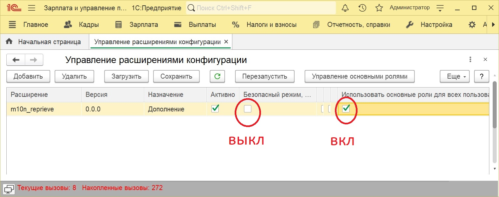
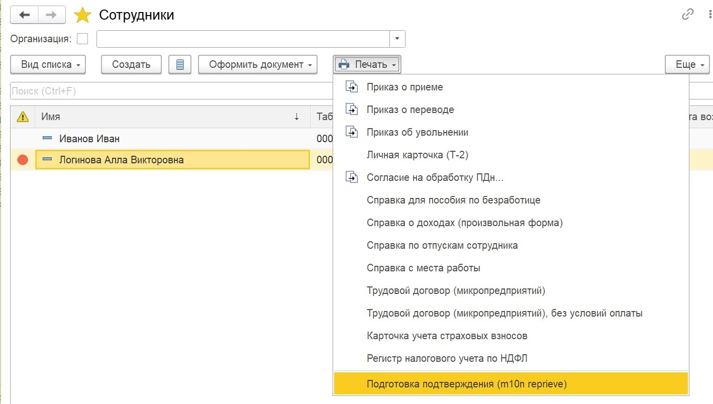
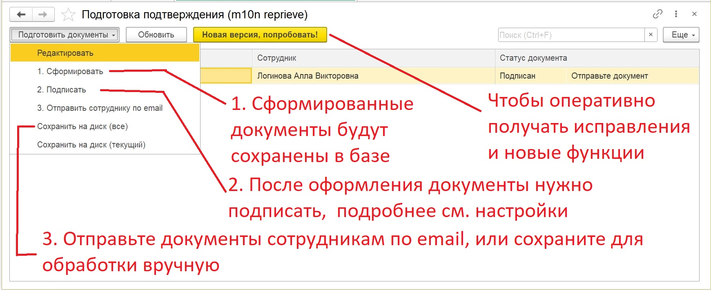
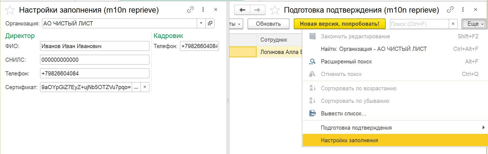

# m10n_reprieve

Расширение для подготовки формы подтверждения заявления на предоставление отсрочки от мобилизации в формате csv

Подойдет для ЗУП, БП, EPR, КА

## Функции

- формирование формы подтверждения заявления на предоставление отсрочки от мобилизации в формате csv
- подписание формы
- рассылка файлов сотрудникам по email (форма.csv, форма.csv.sig, инструкция-госуслуги.pdf)

## Установка

Скачайте последнюю версию расширения конфигурации со [страницы](https://github.com/korotovskih/m10n_reprieve/releases), установите ее "Функции для технического специалиста" -> "Управление расширениями конфигурации"

**Важно!** чтобы все работало правильно, отключите безопасный режим и включите использование основных ролей для всех пользователей/

Если вы продвинутый пользователь, вы знаете что делать, удачи!

## Подготовка документов

Чтобы начать подготовку документов:

- откройте список сотрудников
- выделите несколько
- запустите печатную фору **Подготовка подтверждения (m10n reprieve)**

Сформируйте, подпишите и отправьте документы сотрудникам!

**Важно!** рассылка выполняется с использованием системной учетной записи см. справочник "настройки почты"

**Важно!** сертификат для подписания выбирается в **"настройках заполнения"** для каждой организации отдельно

## Настройки

В общем случае мы можем получить из базы все необходимые данные, но дополнительно позволяем установить значения по умолчанию

**Важно!** сертификат для подписания нужно выбрать вручную, ничего страшного, что его значение выглядит, как что-то не понятное

